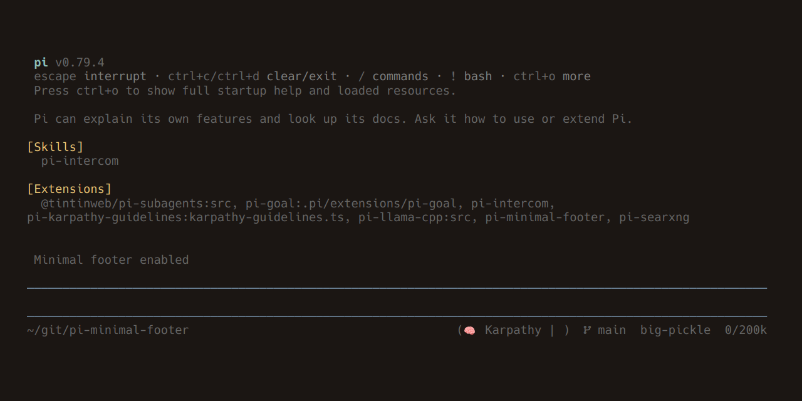

# pi-minimal-footer

<p>
  <a href="https://www.npmjs.com/package/pi-minimal-footer">
    
  </a>
  <a href="https://www.npmjs.com/package/pi-minimal-footer">
    
  </a>
  <a href="LICENSE">
    
  </a>
  <a href="https://pi.dev/packages/pi-minimal-footer">
    
  </a>
</p>

A clean, compact one-line footer for [pi](https://github.com/earendil-works/pi) — [available on the pi package gallery](https://pi.dev/packages/pi-minimal-footer).

```
~/path/to/dir                (skill1 | skill2)   main  sonnet  12/128k
```



## Install

```bash
# From npm (recommended)
pi install npm:pi-minimal-footer

# From git
pi install git:github.com/Ryu-CZ/pi-minimal-footer

# Manual — copy into your extensions directory
cp -r extensions/* ~/.pi/agent/extensions/

# Development — symlink for live edits
ln -s "$PWD/extensions" ~/.pi/agent/extensions/minimal-footer
```

## Features

- **Working directory** — relative path from home (`~/...`)
- **Active skills** — extensions reporting their current status
- **Git branch** — current branch name
- **Model** — active model ID
- **Context usage** — tokens used / context window (e.g., `12/128k`)

## Commands

| Command | Description |
|---|---|
| `/minfooter` | Toggle the extension on/off |
| `/minfooter on` | Enable |
| `/minfooter off` | Disable |

> The `/minfooter` command only toggles the `enabled` flag. To show or hide individual segments, edit `~/.pi/agent/settings.json` directly.

## Configuration

Settings live in `~/.pi/agent/settings.json` under the `minFooter` key:

```json
{
  "minFooter": {
    "enabled": true,
    "showGitBranch": true,
    "showSkills": true,
    "showPath": true,
    "showModel": true,
    "showContext": true
  }
}
```
