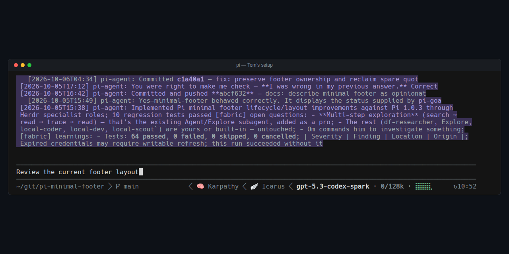

# pi-minimal-footer

<p>
  <a href="https://www.npmjs.com/package/pi-minimal-footer"></a>
  <a href="https://www.npmjs.com/package/pi-minimal-footer"></a>
  <a href="LICENSE"></a>
  <a href="https://pi.dev/packages/pi-minimal-footer"></a>
</p>

An opinionated, compact one-line footer for [Pi](https://github.com/earendil-works/pi).

Path and branch on the left; extension statuses, model, context, and subscription usage bar on the right. Shrinks to fit narrow terminals. Interactive terminal UI only.



## Install

Requires Node.js >=22.19.0.

```bash
pi install npm:pi-minimal-footer
# Or install from source:
pi install git:github.com/Ryu-CZ/pi-minimal-footer
```

## Commands

| Command | Action |
|---|---|
| `/minfooter` | Toggle footer |
| `/minfooter on` | Enable |
| `/minfooter off` | Disable |

## Settings

Edit `minFooter` in Pi's agent `settings.json` (normally `~/.pi/agent/settings.json`). All defaults are shown below. Apply edits with `/reload` or `/minfooter on`.

```json
{
  "minFooter": {
    "enabled": true,
    "showGitBranch": true,
    "showSkills": true,
    "showPath": true,
    "showModel": true,
    "showContext": true,
    "powerlineSeparator": true
  }
}
```

- `showSkills` shows **extension status text**, not installed skills. The footer does not add the example statuses itself.
- Set `powerlineSeparator` to `false` for plain spaces instead of `` / `` if your font lacks those glyphs. The git icon `` also needs a compatible font; hide it with `showGitBranch: false` if needed.
- Context `42/200k` means tokens used / context window. `?` means Pi has not reported usage yet, including immediately after compaction.

## Reading subscription usage

`⣿⣿⣿⣤⠀⠀⠀⠀⠀⠀↻1d8h` shows **subscription allowance used**, not context usage.

- Bar: 5–10 cells, expanding into spare space; green below 85%, amber from 85%, red from 92%. Dim means cached after a refresh failure. Very narrow terminals may show fewer cells or only the reset label.
- Reset: local `↻HH:mm` through 24 hours; whole days/hours above 24 hours (`↻1d8h`); whole days above 10 days (`↻12d`). Remaining durations round down. No reset reported means bar only.
- Shows the shortest available usage window for the selected provider. Missing credentials, unsupported/local models, or absent limits hide the usage bar. Custom proxy endpoints are not polled.

Supported adapters: **OpenAI Codex, Claude OAuth, GitHub Copilot, Gemini CLI, MiniMax, Kimi Coding, and OpenCode Go**. Uses Pi's existing credentials; ordinary Claude API keys do not expose subscription usage. Provider availability varies; authenticated endpoints remain unverified live.

## Development & design

See [VISION.md](VISION.md) for design constraints, local development, provider details, and verification limits. Release history: [CHANGELOG.md](CHANGELOG.md).

## Credits

Provider usage-fetching and parsing logic **copied and adapted from [Can Celik (@ogulcancelik)'s pi-minimal-footer](https://pi.dev/packages/@ogulcancelik/pi-minimal-footer)**. Upstream MIT attribution is retained in [extensions/lib/LICENSE](extensions/lib/LICENSE).
