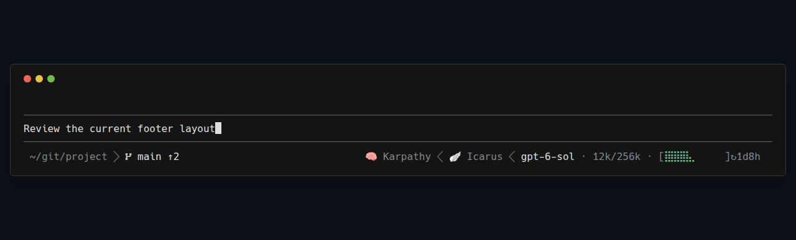
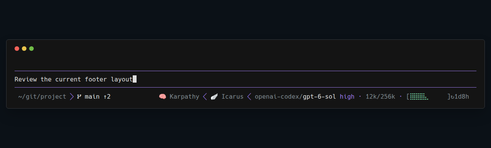
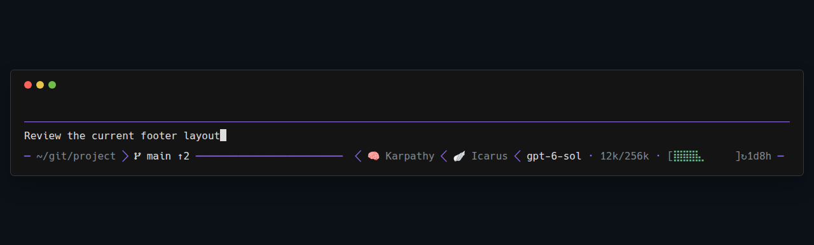

# pi-minimal-footer

<p>
  <a href="https://www.npmjs.com/package/pi-minimal-footer"></a>
  <a href="https://www.npmjs.com/package/pi-minimal-footer"></a>
  <a href="LICENSE"></a>
  <a href="https://pi.dev/packages/pi-minimal-footer"></a>
</p>

An opinionated, compact, one-line status bar for [Pi](https://github.com/earendil-works/pi).



**Left**

- Working directory: `~/git/project`
- Git branch: ` main ↑2 ↓1` (`↑` to push, `↓` to pull)

**Right**

- Extension statuses: `🧠 Karpathy  🪽 Icarus`
- Model: `model`
- Context usage: `12k/256k` (default), or `4.7%/256k` with `contextAsPercentage: true`
- Subscription usage: `[⣿⣿⣿⣿⣄⠀⠀⠀⠀⠀]↻1d8h`, or estimated session cost: `~$0.123`

## Install

Requires Node.js >=22.19.0. Interactive terminal UI only. Compatibility CI covers Pi 1.0.3, 1.1.0, 1.3.0, 1.4.0, and 1.5.0, including compact-editor mode. Declared support is Pi >=1.0.3 <1.6.0; intervening versions are not individually verified.

```bash
pi install npm:pi-minimal-footer
```

## Commands

| Command | Action |
|---|---|
| `/minfooter` | Toggle footer |
| `/minfooter on` | Enable |
| `/minfooter off` | Disable |

## Settings

Edit `minFooter` in Pi's agent `settings.json` (normally `~/.pi/agent/settings.json`). All defaults are shown below. Apply edits with `/reload` or `/minfooter on`.

```json
{
  "minFooter": {
    "enabled": true,
    "compactEditor": false,
    "showGitBranch": true,
    "showSkills": true,
    "showPath": true,
    "showModel": true,
    "showContext": true,
    "showProvider": false,
    "showThinking": false,
    "showUsage": true,
    "showCost": true,
    "contextAsPercentage": false,
    "powerlineSeparator": true,
    "gitRefreshSeconds": 91,
    "gitFetch": false,
    "gitFetchTimeoutSeconds": 17,
    "maxUsageBarCells": 10
  }
}
```

- `compactEditor` embeds the footer in the editor's bottom separator, saving one row; experimental, default `false`. See [compact editor](#compact-editor) for limitations.
- `showProvider` prefixes the model with its provider id, e.g. `opencode-go/deepseek-v4.1-flash`; default `false`.
- `showThinking` appends the thinking level for reasoning models, e.g. `deepseek-v4.1-flash high` or `thinking off`, in the theme's thinking-level color; default `false`.
- `showSkills` shows **extension status text**, not installed skills. The footer does not add the example statuses itself.
- `showUsage` shows subscription usage; set it to `false` to hide the bar and stop quota queries. Default `true`.
- `showCost` shows estimated session cost when no subscription bar is shown. Set it to `false` to hide cost. Default `true`.
- Set `powerlineSeparator` to `false` for plain spaces instead of `` / `` if your font lacks those glyphs. The git icon `` and sync arrows also need compatible glyphs; hide Git data with `showGitBranch: false` if needed.
- `gitRefreshSeconds`: local refresh interval; `1`–`2147483` seconds; default `91`.
- `gitFetch`: background fetch on startup, then roughly 5 minutes after each attempt completes; failures are silent; default `false`.
- `gitFetchTimeoutSeconds`: fetch timeout; `1`–`2147483` seconds; default `17`. Invalid timer settings use their defaults.
- `maxUsageBarCells` caps the Braille bar length (excluding brackets and reset time). Use a positive integer, e.g. `4` for a compact bar; invalid values fall back to `10`.

With `showProvider` and `showThinking` enabled:



### Compact editor

Set `"compactEditor": true` to replace both the footer and prompt editor, embedding the status line in the prompt's bottom separator to save one row:



See [compatibility and layout-switching details](https://github.com/Ryu-CZ/pi-minimal-footer/blob/main/VISION.md#compact-editor-contract).

## Reading the footer

### Git

Counts require a configured upstream. Unsynced branches use normal text color; synced branches are dim. Count changes pulse the whole Git section bold for one second; further changes restart the pulse.

### Context

`12k/256k` means tokens used / context window. Set `"contextAsPercentage": true` to show `4.7%/256k` instead. Unknown usage shows `?/256k` when the window is known, or `?` otherwise.

The context label turns yellow at 85% and red at 92% of Pi's configured compaction threshold, in either display mode.

### Usage or cost

- **Subscription:** shows your allowance when available and `showUsage` is enabled; this takes priority.
- **Pay per token:** shows estimated session cost when `showCost` is enabled, e.g. `~$0.123` (USD)—not your account balance or final bill.
- **Neither available:** hides the field, as with a local llama.cpp server without pricing.

#### Subscription usage

`[⣿⣿⣿⣿⣄⠀⠀⠀⠀⠀]↻1d8h` shows **subscription allowance used** (44% here), not context usage.

- **Bar:** expands into spare space, using 2–10 cells by default, capped by `maxUsageBarCells`. Smaller caps and very narrow terminals may show fewer cells or only the reset label.
- **Colors:** green below 85%, amber from 85%, red from 92%.
- **Cached data:** dim after a refresh failure or when its reset time has passed.
- Reset: local `↻HH:mm` through 24 hours; whole days/hours above 24 hours (`↻1d8h`); whole days above 10 days (`↻12d`). Remaining durations round down. No reset reported means bar only.
- Shows the shortest available usage window for the selected provider. Missing credentials, unsupported/local models, or absent limits hide the usage bar. Custom proxy endpoints are not polled.
- Virtual/routed models show model and context usage, but no subscription bar.

#### Supported subscriptions

Uses your existing Pi login; ordinary Claude API keys do not expose subscription usage.

*Authenticated endpoints remain unverified live; see [verification limits](https://github.com/Ryu-CZ/pi-minimal-footer/blob/main/VISION.md).*

Supported services:
 - **OpenAI Codex**
 - **Claude OAuth**
 - **GitHub Copilot**
 - **Gemini CLI**
 - **MiniMax**
 - **Kimi Coding**
 - **OpenCode Go**

### Extension statuses

Provided by other extensions; hidden with `showSkills: false`. Narrow terminals may shorten or omit them.

Only one footer extension can be active. For plugin integration, see [VISION.md](https://github.com/Ryu-CZ/pi-minimal-footer/blob/main/VISION.md#plugin-integration).

## Integrations

Other extensions can control footer visibility, subscription usage, estimated cost, and compact mode for the current session without changing your saved settings. New sessions and `/reload` restore your preferences.

For extension authors: [integration guide](https://github.com/Ryu-CZ/pi-minimal-footer/blob/main/VISION.md#session-only-footer-control).

## Development & design

Install from source:

```bash
pi install git:github.com/Ryu-CZ/pi-minimal-footer
```

Developer guide: [VISION.md](https://github.com/Ryu-CZ/pi-minimal-footer/blob/main/VISION.md). Release history: [CHANGELOG.md](CHANGELOG.md).

## Credits

Provider usage-fetching and parsing logic **copied and adapted from [Can Celik (@ogulcancelik)'s pi-minimal-footer](https://pi.dev/packages/@ogulcancelik/pi-minimal-footer)**. Upstream MIT attribution is retained in [extensions/lib/LICENSE](extensions/lib/LICENSE).
